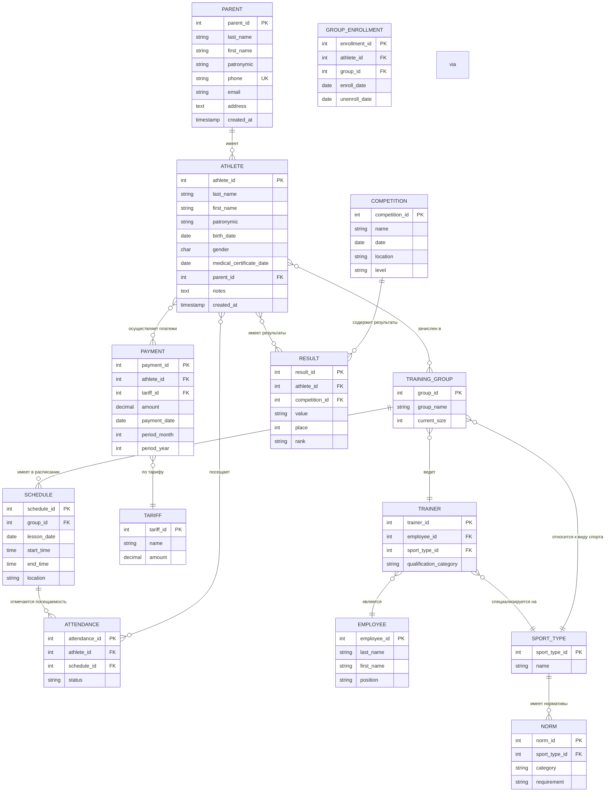

```mermaid
erDiagram
    PARENT {
        int parent_id PK
        string last_name
        string first_name
        string patronymic
        string phone UK
        string email
        text address
        timestamp created_at
    }

    ATHLETE {
        int athlete_id PK
        string last_name
        string first_name
        string patronymic
        date birth_date
        char gender
        date medical_certificate_date
        int parent_id FK
        text notes
        timestamp created_at
    }

    TRAINING_GROUP {
        int group_id PK
        string group_name
        int current_size
    }

    GROUP_ENROLLMENT {
        int enrollment_id PK
        int athlete_id FK
        int group_id FK
        date enroll_date
        date unenroll_date
    }

    SCHEDULE {
        int schedule_id PK
        int group_id FK
        date lesson_date
        time start_time
        time end_time
        string location
    }

    ATTENDANCE {
        int attendance_id PK
        int athlete_id FK
        int schedule_id FK
        string status
    }

    PAYMENT {
        int payment_id PK
        int athlete_id FK
        int tariff_id FK
        decimal amount
        date payment_date
        int period_month
        int period_year
    }

    TARIFF {
        int tariff_id PK
        string name
        decimal amount
    }

    TRAINER {
        int trainer_id PK
        int employee_id FK
        int sport_type_id FK
        string qualification_category
    }

    EMPLOYEE {
        int employee_id PK
        string last_name
        string first_name
        string position
    }

    SPORT_TYPE {
        int sport_type_id PK
        string name
    }

    COMPETITION {
        int competition_id PK
        string name
        date date
        string location
        string level
    }

    RESULT {
        int result_id PK
        int athlete_id FK
        int competition_id FK
        string value
        int place
        string rank
    }

    NORM {
        int norm_id PK
        int sport_type_id FK
        string category
        string requirement
    }

    PARENT ||--o{ ATHLETE : "имеет"
    ATHLETE }o--o{ TRAINING_GROUP : "зачислен в" via GROUP_ENROLLMENT
    TRAINING_GROUP ||--o{ SCHEDULE : "имеет в расписании"
    SCHEDULE ||--o{ ATTENDANCE : "отмечается посещаемость"
    ATHLETE }o--o{ ATTENDANCE : "посещает"
    ATHLETE }o--o{ PAYMENT : "осуществляет платежи"
    PAYMENT }o--|| TARIFF : "по тарифу"
    TRAINING_GROUP }o--|| TRAINER : "ведет"
    TRAINER }o--|| EMPLOYEE : "является"
    TRAINER }o--|| SPORT_TYPE : "специализируется на"
    TRAINING_GROUP }o--|| SPORT_TYPE : "относится к виду спорта"
    ATHLETE }o--o{ RESULT : "имеет результаты"
    COMPETITION ||--o{ RESULT : "содержит результаты"
    SPORT_TYPE ||--o{ NORM : "имеет нормативы"
```
